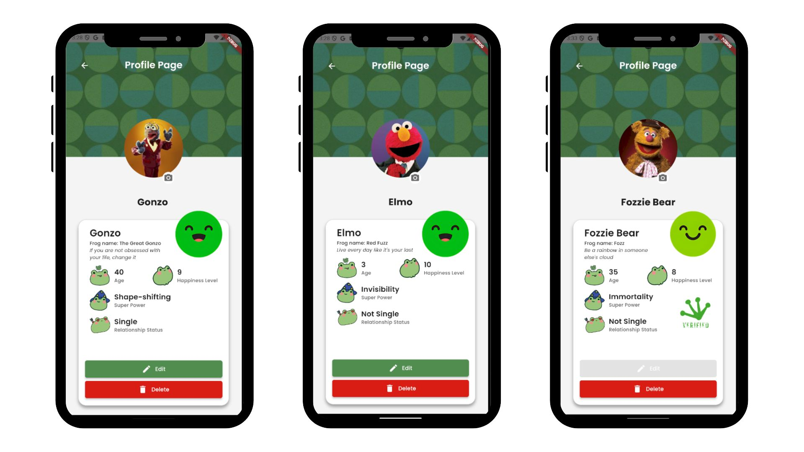
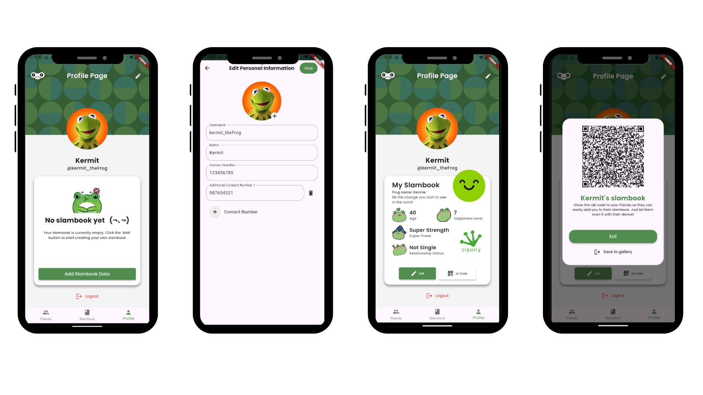

# CMSC 23 - Mobile Computing Mini Project

**Name:** Vinly G. Tolentino <br/>
**Section:** U-2L <br/>
**Student number:** 2022 - 10929 <br/>


## Ribbit App

Introducing **Ribbit** , a slambook application with a charming frog theme, designed to bring a modern touch to the classic tradition of friendship books. Ribbit allows you to **add friends**, **create and personalize your own slambook**, and **share it seamlessly with your friends**.

## Key Features

- **Create Your Own Account**: Ensure your slambook entries and personal information are secure with a private account.
- **Personalize Your Slambook**: Customize your slambook with unique questions, profile pictures, and other intriguing details. Invite your friends to contribute their answers and create a memorable keepsake.
- **Add Friends via QR Scanner or Manually**: Easily add friends to your slambook by scanning a QR code or entering their information manually.
- **View Friends List and Their Slambook Data**: Access a list of your friends and view their slambook entries.
- **Shareable QR Code**: Generate a QR code that allows your friends to add you instantly, facilitating easy and quick connections.


## How to use Ribbit App

 

1. **Create an Account:** Sign up via Google or manually by filling in the required fields.

2. **Sign In:** After signing up, you're automatically logged in. For future logins, use your account credentials.

 

3. **Add Friends:** Navigate to the slambook page, input your friend's information, and click submit. A summary dialog will pop up after submitting. Alternatively, use the add button on the friends page or the QR code scanner. Friends added via QR code are marked as verified.

 

4. **Manage Friends:** View your friends on the friends page. Edit, change profile pictures, or delete a friend using the three dots menu. 
> [!NOTE]
> You can't edit the information of a verified friend except for their picture. Also, you can't change your friends' names.

 

5. **View Friends' Slambook:** Click on a friend to view their slambook page with their information and helpful buttons.

 

6. **Edit Profile:** On the profile page, click the edit button to update your username, profile picture, and contact numbers. You can also add or edit your slambook data.

7. **Generate QR Code:** Create a shareable QR code so friends can scan it to add you instantly.

8. **Logout:** Use the logout button to sign out of the app.


## Installation Guide

Ribbit is developed using Dart and Flutter. To install the app on an Android phone, follow these steps:

1. **Install Android Studio**: Download and install [Android Studio](https://developer.android.com/studio). Set up the Android Emulator or connect your Android device via USB debugging.
2. **Install Dart and Flutter**: Ensure that Dart and Flutter are installed on your development machine. Follow the installation instructions in the [Flutter documentation](https://flutter.dev/docs/get-started/install) to set up both.
3. **Open the Project**: Launch Android Studio or VS Code and open the Ribbit project directory.
4. **Run the App**:
   - If using an emulator, select the desired virtual device in Android Studio and click the "Run" button.
   - If using a physical device, ensure it is connected via USB and USB debugging is enabled. Open a terminal or command prompt in your Ribbit project directory and execute:
     ```bash
     flutter run
     ```

    - Flutter will build the app and install it on your selected device. Follow any additional prompts if needed.
    - For further setup instructions, refer to the [Flutter installation guide](https://docs.flutter.dev/).


## References

### Website Documentations
- [Image Picker Package](https://pub.dev/packages/image_picker)
- [Flutter API: showModalBottomSheet](https://api.flutter.dev/flutter/material/showModalBottomSheet.html)
- [Firebase Storage: Upload Files](https://firebase.google.com/docs/storage/flutter/upload-files#upload_from_a_file)
- [Firebase Storage: Delete Files](https://firebase.google.com/docs/storage/android/delete-files)
- [QR Code Scanner Package](https://pub.dev/packages/qr_code_scanner)
- [Flutter Cookbook: Design Themes](https://docs.flutter.dev/cookbook/design/themes)
- [Dart List.generate Method](https://api.flutter.dev/flutter/dart-core/List/List.generate.html)
- [Google Sign-In Using Firebase Authentication](https://medium.com/@dev.lens/flutter-google-sign-in-using-firebase-authentication-step-by-step-ef2ddfb84a2c)
- [Linking Accounts in Firebase with Different Authentication Providers](https://medium.com/@anusha.btech.2018/flutter-linking-accounts-in-firebase-with-different-authentication-providers-abe993ba4efe)

### Stack Overflow
- [Creating a Modal Bottom Sheet with Circular Corners](https://stackoverflow.com/questions/50376200/how-to-create-a-modal-bottomsheet-with-circular-corners-in-flutter/)
- [Getting Document ID After Adding Document in Cloud Firestore](https://stackoverflow.com/questions/51054460/how-do-you-get-the-document-id-after-adding-document-in-cloud-firestore-in-dart)
- [Running Method on Widget Build Completion](https://stackoverflow.com/questions/49466556/flutter-run-method-on-widget-build-complete)
- [Determining Screen Height and Width](https://stackoverflow.com/questions/49553402/how-to-determine-screen-height-and-width)
- [Flutter Stack Positioning and Overflow](https://stackoverflow.com/questions/68313457/flutter-stack-positioning-and-overflow)
- [Adding a Button to the AppBar Activity in Flutter](https://stackoverflow.com/questions/69299281/how-to-add-a-button-to-the-activity-of-the-appbar-in-flutter)
- [Button Disabled State Based on Multiple TextFormFields](https://stackoverflow.com/questions/73885781/button-disabled-state-bases-on-multiple-textformfields)
- [Background Image Moving When Keyboard Appears](https://stackoverflow.com/questions/65622166/background-image-is-moving-when-keyboards-appears-flutter)
- [Checking If Input Is an Email Address](https://stackoverflow.com/questions/16800540/how-should-i-check-if-the-input-is-an-email-address-in-flutter)
- [Checking If an Email Already Exists in Firebase Auth](https://stackoverflow.com/questions/51652134/check-if-an-email-already-exists-in-firebase-auth-in-flutter-app)
- [Flutter Container onPressed](https://stackoverflow.com/questions/43692923/flutter-container-onpressed)
- [Adding a 3-Dot Pop-Up Menu in the AppBar](https://stackoverflow.com/questions/58144948/easiest-way-to-add-3-dot-pop-up-menu-appbar-in-flutter)
- [Adding Shadow to Widgets](https://stackoverflow.com/questions/52227846/how-can-i-add-shadow-to-the-widget-in-flutter)
- [Layout Widgets Based on Parent Size](https://stackoverflow.com/questions/41558368/how-can-i-layout-widgets-based-on-the-size-of-the-parent)
- [Getting Image from URL to a File in Flutter](https://stackoverflow.com/questions/59546381/how-to-get-image-from-url-to-a-file-in-flutter)
- [Using TextPainter to Draw Text](https://stackoverflow.com/questions/41371449/how-do-you-use-a-textpainter-to-draw-text)


### Images
- [Logo](https://www.brandcrowd.com/maker/logo/frog-amphibian-toad-75777?text=ribbit&isSearch=True)
- [Pinterest Pin: Design Inspiration](https://ph.pinterest.com/pin/625015254566607927/)
- [Rating Satisfaction Feedback Illustration](https://www.istockphoto.com/vector/rating-satisfaction-feedback-in-form-of-emotions-gm1160344267-317584172)
- [Other images are from Canva Elements](https://www.canva.com)
